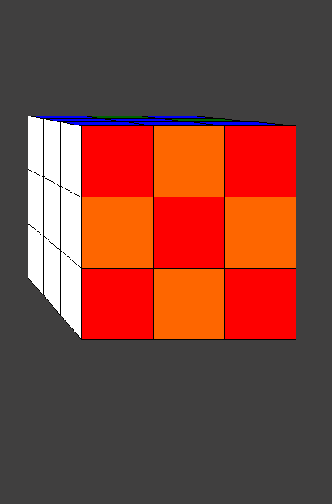

# RubicsCube

## Preview

## Controls:
| Key  | Move |
| ------------- | ------------- |
| ↑  | Right side up  |
| ↓  | Right side down  |
| →  | Turn bottom to right |
| ←  | Turn bottom to left |
| w  | Left side up  |
| a  | Left side down  |
| s  | Turn top to right |
| d  | Turn top to left |
| space | Mix Cube |
| z | back |
| shift + ↑  | Turn cube up  |
| shift + ↓  | Turn cube down  |
| shift + →  | Turn cube right |
| shift + ←  | Turn cube left |

## Simulation:
I have uploaded some gifs [here](https://drive.google.com/folderview?id=1eLA_Ay4mAeNofOeY7l7ZYu2roff85D3Z), so you can see what the program looks like.
